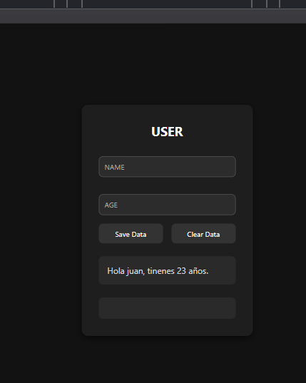

# Formulario Interactivo - Modo Oscuro

Este proyecto es una interfaz de formulario sencilla desarrollada con **HTML**, **CSS** (modo oscuro) y **JavaScript**. Permite al usuario ingresar su nombre y edad, guardar esta información en el navegador y visualizarla dinámicamente. También ofrece la opción de limpiar los datos.

##  Tecnologías utilizadas

- HTML5
- CSS3
- JavaScript (DOM y LocalStorage)

##  Estructura de Archivos
├── index.html
├── script.js
├── assets/
│ └── styles/
│ └── index.css
│ └── img

##  Funcionalidades

- Entrada de datos: nombre (texto) y edad (número).
- Botón **Guardar**: guarda los datos del formulario y los muestra.
- Botón **Limpiar**: borra los datos guardados.
- Modo oscuro amigable con la vista.
- Estilo limpio, moderno y centrado verticalmente.

##  Lógica JavaScript (`script.js`)

- Guarda datos en `localStorage` tras validarlos.
- Usa una expresión regular para permitir solo letras y espacios en el nombre.
- Recupera y muestra datos almacenados al cargar la página.
- Cuenta las interacciones del usuario usando `sessionStorage`.
- Permite limpiar datos almacenados y reiniciar la vista.


## 📸 Capturas de pantalla

### 1. Datos almacenados en Local Storage

Visualización en la pestaña de "Aplicación" (DevTools):


---

### 2. Contador de interacciones en Session Storage

Visualización de sessionStorage incrementándose tras cada clic:


---

### 3. Mensaje dinámico mostrado en pantalla

Ejemplo del mensaje generado tras guardar datos válidos:




## Cómo ejecutar el proyecto

1. Clona este repositorio:

```bash
git clone https://github.com/Andrea2301/M3S4.git
